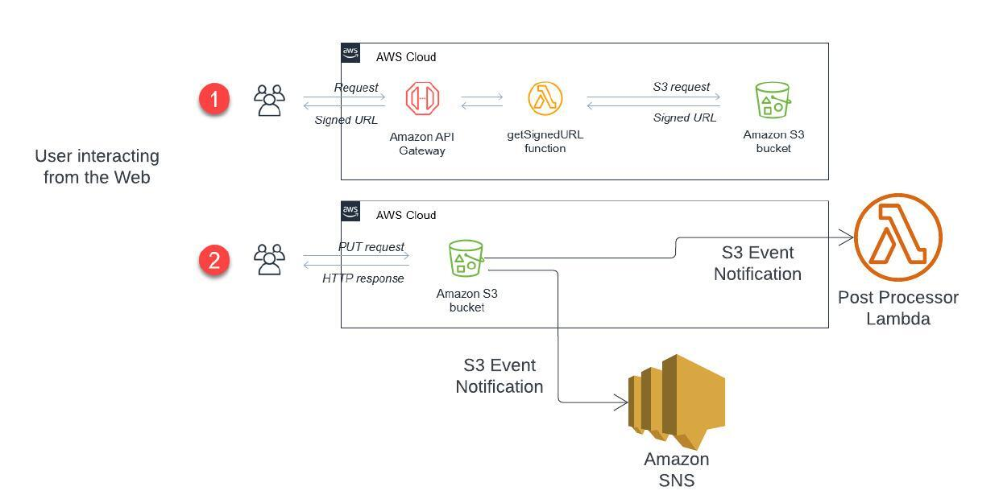

# Overview
This project is used to demonstrate number of AWS services with the help of an AWS Blog and some other custom steps.
We will build a website using AWS Amplify where a user can upload a file to S3 bucket using S3 Pre-Signed URL.
As a fresher in cloud let's take a approach to learn it from the ground zero.
You will learn each services with an example first and later integrate all of them to make working solution.
Try to learn about the service as much as you can and also make sure you can acomplish the project.

# Services we used in this exercise

1. AWS CodeCommit
2. AWS Amplify
3. [AWS API Gateway](https://docs.aws.amazon.com/apigateway/latest/developerguide/welcome.html)
4. [AWS Lambda](https://docs.aws.amazon.com/lambda/latest/dg/welcome.html)
5. [AWS S3](https://docs.aws.amazon.com/AmazonS3/latest/userguide/Welcome.html)
6. AWS SNS
7. AWS SES
8. AWS SAM
9. AWS Cloudformation (Although we used SAM, SAM behind the seen create Cloudformation Stack to create all the resources.)

# What to do now?
Use below referenes to learn about the services we used in this solution.

1. With a simple HTML file, create a CodeCommit repo, use AWS Amplify Service to host your web app
2. [Create a API Gateway API and integrate with a sample lambda](https://docs.aws.amazon.com/lambda/latest/dg/services-apigateway-tutorial.html).
3. [Walkthrough: Configuring a bucket for notifications (SNS topic)](https://docs.aws.amazon.com/AmazonS3/latest/userguide/ways-to-add-notification-config-to-bucket.html)
4. Use S3 Event configuration to trigger a simple lambda. Try it yourself

# S3 presigned URLs with SAM, auth and sample frontend

Read about [S3PreSignedUrl](https://docs.aws.amazon.com/AmazonS3/latest/userguide/using-presigned-url.html)

This example application shows how to upload objects to S3 directly from your end-user application using Signed URLs.

To learn more about how this application works, see the AWS Compute [Blog post](https://aws.amazon.com/blogs/compute/uploading-to-amazon-s3-directly-from-a-web-or-mobile-application/)

Important: this application uses various AWS services and there are costs associated with these services after the Free Tier usage - please see the [AWS Pricing page](https://aws.amazon.com/pricing/) for details. You are responsible for any AWS costs incurred. No warranty is implied in this example.

```bash
.
├── README.MD                   <-- This instructions file
├── frontend                    <-- Simple JavaScript application illustrating upload
├── getSignedURL                <-- Source code for the serverless backend
```

## Requirements

* [AWS CLI Installed](https://docs.aws.amazon.com/cli/latest/userguide/getting-started-install.html)
* AWS CLI already configured with Administrator permission
* [AWS SAM CLI installed](https://docs.aws.amazon.com/serverless-application-model/latest/developerguide/serverless-sam-cli-install.html) - minimum version 0.48.
* [NodeJS 16.x installed](https://nodejs.org/en/download/)

## Installation Instructions

1. [Create an AWS account](https://portal.aws.amazon.com/gp/aws/developer/registration/index.html) if you do not already have one and login.

2. Clone the repo onto your local development machine using `git clone`.

### Installing the application

There are two SAM templates available - one provides an open API, the other uses an authorizer. From the command line, deploy the chosen SAM template:
By defalut you are going to use template.yaml. I have shown you in calss with template.yaml
```
cd .. 
sam deploy --guided
```

When prompted for parameters, enter:
- Stack Name: s3Uploader
- AWS Region: your preferred AWS Region (e.g. us-east-1)
- Answer 'Y' to `UploadRequestFunction may not have authorization defined, Is this okay?` question, and accept others defaults.

This takes several minutes to deploy. At the end of the deployment, note the output values, as you need these later.

- The APIendpoint value is important - it looks like https://ab123345677.execute-api.us-west-2.amazonaws.com.
- **The upload URL is your endpoint** with the /uploads route added - for example: https://ab123345677.execute-api.us-west-2.amazonaws.com/uploads.
- Update index.html file with the endpoint


### Testing with the frontend application

The frontend code is saved in the `frontend` subdirectory. 

1. Before running, you need to set the API Gateway endpoint from the backend deployment on line 29 in the `index.html` file.

2. You cannot run this directly on a local browser, due to way CORS works with localhost. [deploy using AWS Amplify Console](https://aws.amazon.com/amplify/console/).
3. In order to use Amplify you will have to upload the index.html file in a git repo - preference is to use AWS CodeCommit. Make sure the index.html file is in the root of the repo. That's the place where amplify will look for the index.html file.
4. Once the page is loaded from a remote location, upload a JPG file in the front-end and you will see the object in the backend S3 bucket.

## Next steps

The AWS Compute Blog post at the top of this README file contains additional information about this pattern.

If you have any questions, please raise an issue in the GitHub repo.

==============================================

